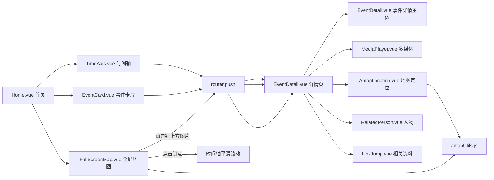
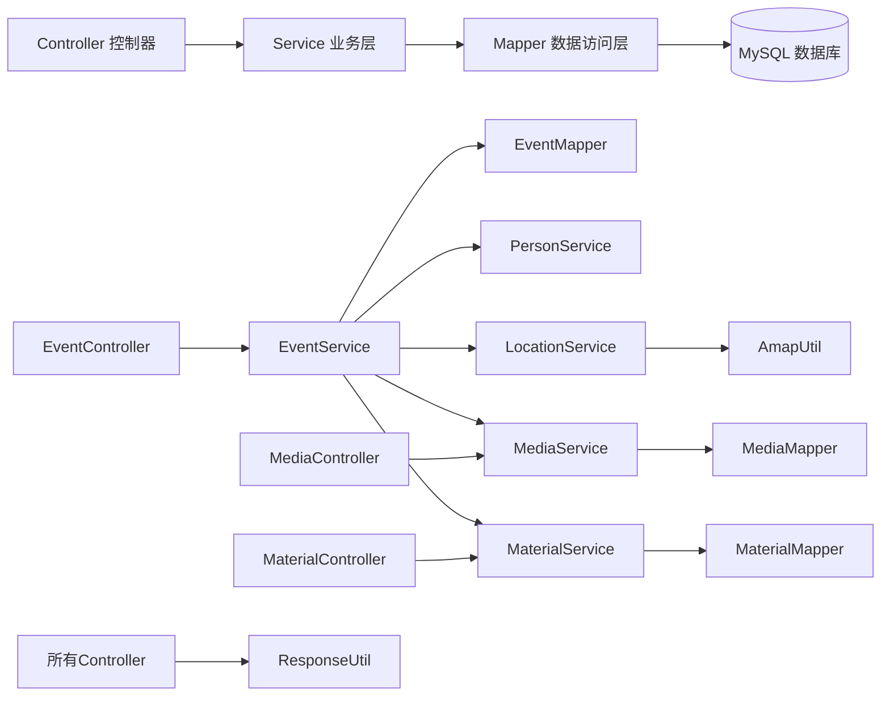

本文件用于说明“抗日战争时间轴”项目的 **前后端结构** 与 **模块引用关系**，帮助团队成员快速理解代码布局、数据流向以及地图 / 时间轴 / 多媒体 / 相关资料之间的联动。

---

## 一、前端项目结构（Vue3 + Vite）

### 1. 核心设计逻辑

按“**页面（views） → 业务组件（components） → 工具（utils） → API（api）**”分层。  
首页负责“时间轴 + 地图联动”，详情页负责“事件全文 + 多媒体 + 地图定位 + 人物 + 相关资料”。

```text
red-history-timeline-frontend/
├── public/                       # 静态资源（Vite 直接暴露）
│   └── assets/
│       └── images/              # 事件配图：{eventId}.png，例如 E001.png
├── src/
│   ├── api/                     # 后端接口封装
│   │   ├── eventApi.js          # 事件接口（列表 / 详情）
│   │   ├── personApi.js         # 人物接口（按事件查人物）
│   │   ├── locationApi.js       # 地点 / 坐标接口（地图标记）
│   │   ├── mediaApi.js          # 媒体资源接口（图片 / 视频 / 音频）
│   │   └── materialApi.js       # 相关资料接口（外部权威链接）
│   ├── components/
│   │   ├── home/                # 首页组件
│   │   │   ├── TimeAxis.vue     # 竖直时间轴（支持放大缩小 + 地图联动滚动）
│   │   │   ├── EventCard.vue    # 事件卡片列表（补充展示）
│   │   │   └── FullScreenMap.vue# 全屏地图（地图钉 + 钉上方事件预览图）
│   │   ├── detail/              # 详情页组件
│   │   │   ├── EventDetail.vue  # 事件详情主体（标题 / 日期 / 背景 / 影响等）
│   │   │   ├── MediaPlayer.vue  # 多媒体播放器（图片轮播 + 视频 / 音频 + B站嵌入）
│   │   │   ├── AmapLocation.vue # 高德地图定位（详情页小地图）
│   │   │   └── RelatedPerson.vue# 相关人物列表
│   │   └── common/              # 通用组件
│   │       ├── LinkJump.vue     # 相关资料跳转（图标按钮 + 新窗口打开）
│   │       └── BackButton.vue   # 返回按钮（详情页 → 首页）
│   ├── views/
│   │   ├── Home.vue             # 首页：左时间轴 + 右地图
│   │   └── EventDetail.vue      # 详情页：事件 + 多媒体 + 地图 + 人物 + 资料
│   ├── router/
│   │   └── index.js             # 路由规则（/ → Home，/detail/:id → EventDetail）
│   ├── utils/
│   │   ├── request.js           # Axios 封装，统一处理后端响应
│   │   ├── amapUtils.js         # 高德地图工具（初始化 / 标记 / 定位）
│   │   └── formatUtils.js       # 格式化工具（日期等）
│   ├── styles/
│   │   └── base.scss            # 全局样式（红色主题、基础布局）
│   ├── App.vue                  # 根组件
│   └── main.js                  # 入口文件
├── package.json                 # 前端依赖
└── vite.config.js               # Vite 配置（别名 / 代理）
```

> 说明：高德地图 Key 由 `index.html` / 环境变量 `VITE_AMAP_KEY` 提供，`amapUtils.js` 统一负责加载。

### 2. 前端核心引用关系

#### (1) 组件间引用



- **TimeAxis.vue**
  - 挂载时调用 `eventApi.getEventList()` 加载事件；
  - 提供 `scrollToEvent(eventId)`、`scrollToLocation(locationId)` 方法，供首页 `Home.vue` 在地图点击时滚动到对应事件；
  - 支持通过缩放按钮 / `Alt + 滚轮` 调整事件间距（时间轴缩放）。

- **FullScreenMap.vue**
  - 使用 `locationApi.getAllLocations()` 加载地点数据；
  - 使用 `amapUtils.initMap` 初始化高德地图；
  - 为每个地点添加两个 Marker：
    - 普通钉点（点击触发 `marker-click`，仅滚动时间轴）；
    - 叠加的小图片 Marker（点击触发 `marker-image-click`，进入详情页）；
  - 从 `eventApi.getEventList()` 推导 `locationId → eventId` 的映射，以便图片和详情跳转对应正确事件。

- **MediaPlayer.vue**
  - 接收 `images / videos / audios` 数组（来自 `mediaApi.getMediaByEvent`）；
  - 对 `video.url` 进行判断：
    - 普通 MP4 → `<video>` 播放；
    - 含 `bilibili.com/video/` → 转为 `https://player.bilibili.com/player.html?bvid=...`，用 `<iframe>` 播放 B 站视频。

- **LinkJump.vue**
  - 接收 `links`（由 `materials` 表或 `event.relatedMaterials` 转换而来），展示为可点击的链接按钮，`target="_blank"` 新窗口打开。

#### (2) API / 工具引用关系

- 所有数据请求：组件 → `src/api/*.js` → `utils/request.js` → 后端 `/api/...`
- 地图组件（`FullScreenMap`、`AmapLocation`）：组件 → `amapUtils.js` → 高德 JS API
- 主要 API 对应：
  - `eventApi.js` → `/api/events`：事件列表 / 详情；
  - `locationApi.js` → `/api/locations`：地点列表 / 坐标；
  - `mediaApi.js` → `/api/media/event/{eventId}`：媒体资源（含 B 站链接）；
  - `materialApi.js` → `/api/materials/event/{eventId}`：相关资料列表；
  - `personApi.js` → `/api/persons/...`：人物相关信息。

---

## 二、后端项目结构（Java + Spring Boot）

### 1. 核心设计逻辑

按“**Controller（控制器） → Service（业务层） → Mapper（数据访问） → Model（实体） → MySQL**”分层。  
围绕 **events / persons / locations / media / materials** 五类数据，为前端提供统一的 REST 接口。

```text
red-history-timeline-backend/
├── src/main/java/com/redhistory/
│   ├── controller/
│   │   ├── EventController.java       # 事件接口（列表 / 详情 / 按地点等）
│   │   ├── PersonController.java      # 人物接口
│   │   ├── LocationController.java    # 地点 / 坐标接口
│   │   ├── MediaController.java       # 多媒体接口（图片 / 视频 / 音频）
│   │   └── MaterialController.java    # 相关资料（外部权威链接）
│   ├── service/
│   │   ├── EventService.java          # 事件业务（聚合人物 / 地点 / 媒体）
│   │   ├── PersonService.java
│   │   ├── LocationService.java
│   │   ├── MediaService.java
│   │   └── MaterialService.java       # 相关资料业务
│   ├── mapper/
│   │   ├── EventMapper.java
│   │   ├── PersonMapper.java
│   │   ├── LocationMapper.java
│   │   ├── MediaMapper.java
│   │   └── MaterialMapper.java
│   ├── model/
│   │   ├── Event.java                 # events 表
│   │   ├── Person.java                # persons 表
│   │   ├── Location.java              # locations 表
│   │   ├── Media.java                 # media 表（含 B 站链接）
│   │   └── Material.java              # materials 表（外部资料）
│   ├── config/
│   │   ├── CorsConfig.java
│   │   └── RestTemplateConfig.java    # AmapUtil 使用的 RestTemplate
│   ├── util/
│   │   ├── ResponseUtil.java          # 统一响应 {code,msg,data,total}
│   │   └── AmapUtil.java              # 可选：后端调用高德解析坐标
│   └── RedHistoryApplication.java     # Spring Boot 启动类
├── src/main/resources/
│   ├── application.yml                # 端口 / 数据库 / MyBatis 配置
│   └── mybatis/
│       ├── EventMapper.xml
│       ├── MediaMapper.xml
│       ├── MaterialMapper.xml
│       └── ...                        # 其他 Mapper 映射
└── scripts/
    ├── init-db.sql                    # 建表脚本（含 materials）
    ├── import-data.sql                # 初始示例数据
    ├── import-data-from-json.sql      # 从 JSON 生成的完整数据
    ├── import-media-bilibili-9.sql    # 从 data/vedio.txt 映射的 B 站视频
    └── import-materials-from-md.sql   # 从 data/相关资料.md 映射的权威链接
```

### 2. 后端核心引用关系



#### 3. 前后端接口对应关系

| 前端 API 文件      | 后端 Controller        | 主要路径示例                                 | 说明                          |
|--------------------|------------------------|----------------------------------------------|-------------------------------|
| `eventApi.js`      | `EventController`      | `GET /api/events`，`GET /api/events/{id}`   | 事件列表 / 详情               |
| `locationApi.js`   | `LocationController`   | `GET /api/locations`                        | 地点 + 坐标，用于地图标记     |
| `mediaApi.js`      | `MediaController`      | `GET /api/media/event/{eventId}`            | 事件关联媒体（含 B 站链接）   |
| `materialApi.js`   | `MaterialController`   | `GET /api/materials/event/{eventId}`        | 事件关联权威资料链接           |
| `personApi.js`     | `PersonController`     | `GET /api/persons/...`（示意）              | 相关人物                      |

---

## 三、数据脚本与外部资料来源

### 1. 历史事件 / 人物 / 地点数据

- 来源：`data/historical_data.json`  
- 转换脚本：`scripts/json_to_sql.py`  
- 生成结果：`scripts/import-data-from-json.sql`（推荐使用）

该脚本会为 `events / persons / locations / event_person` 等表生成批量 `INSERT`，并保证使用 `utf8mb4` 以避免中文乱码。

### 2. B 站视频（多媒体映像资料）

- 原始定义：`data/vedio.txt`
- 字段含义：`事件标题: B站链接`
- 映射关系：根据标题与 `events` 中的 `title` 对应，手动核对并映射为 `E001–E020`
- 最终写入：`scripts/import-media-bilibili-9.sql`，插入到 `media` 表，`type='video'`，`url` 为 B 站页地址
- 前端处理：`MediaPlayer.vue` 检测 `url` 中是否包含 `bilibili.com/video/`，若是则转为 B 站嵌入播放器地址。

### 3. 权威资料链接（相关资料栏目）

- 原始定义：`data/相关资料.md`
- 内容：每个事件下面列出来自 人民网 / 新华网 / 国家档案局 / 党史网 / 军网等权威网站的若干链接；
- 映射规则：按时间顺序将 20 个事件标题映射到 `E001–E020`，每个事件 3 条资料；
- 最终写入：`scripts/import-materials-from-md.sql`，插入到 `materials` 表：

  - `id`：如 `mat-001-01`
  - `event_id`：如 `E001`
  - `title`：资料标题
  - `url`：完整网址
  - `type`：简单分类（历史文献 / 新闻报道 / 官方网站 / 百科条目 / 档案资料等）

前端详情页通过 `materialApi.getMaterialsByEvent(eventId)` 获取这些资料，并在 `LinkJump.vue` 中以带图标的按钮列表形式展示。

---

## 四、典型交互链路说明

### 1. 地图钉点 → 时间轴滚动 → 详情页

1. `FullScreenMap.vue` 初始化地图并加载地点：
   - `locationApi.getAllLocations()` + `eventApi.getEventList()` 组合出 `locationId → eventId` 映射；
   - 为每个地点添加：
     - 普通钉点 Marker（点击触发 `marker-click`，`Home.vue` 调用 `TimeAxis.scrollToEvent/scrollToLocation`，只滚动时间轴，不跳转页面）；
     - 图片 Marker（点击触发 `marker-image-click`，`Home.vue` 使用 `router.push('/detail/:id')` 打开详情页）。

2. `TimeAxis.vue` 保持事件列表完整，不再做筛选；只负责平滑滚动到目标事件，并支持缩放“事件间时间间距”。

### 2. 详情页加载数据

`EventDetail.vue` 在挂载时并行调用：

- `eventApi.getEventDetail(eventId)` → 事件基础信息；
- `mediaApi.getMediaByEvent(eventId)` → 本地图片 / B 站视频 / 音频；
- `materialApi.getMaterialsByEvent(eventId)` → 权威资料链接；
- 若事件包含 `locationId`，则 `locationApi.getLocationDetail(locationId)` → 地图定位。

然后将数据分发给：

- `EventDetail`（事件全文）；
- `MediaPlayer`（多媒体轮播 + 视频 / 音频 / B 站嵌入）；
- `AmapLocation`（小地图）；
- `RelatedPerson`（内部再调用人物 API）；
- `LinkJump`（相关资料链接）。

---

## 五、总结

- **前端**：围绕首页“抗日战争时间轴 + 地图联动”和详情页“多媒体 + 地图 + 人物 + 资料”进行模块化拆分，所有地图 / 请求逻辑集中在 `amapUtils.js` / `request.js` / `api/*.js` 中，便于维护与扩展。
- **后端**：在原有事件 / 人物 / 地点 / 媒体的基础上新增 `materials`，从 `data/vedio.txt` 与 `data/相关资料.md` 自动导入多媒体与资料链接，保证所有展示内容都有统一的数据来源。
- **联动逻辑**：通过清晰的组件与 API 引用关系，实现“地图钉点 → 时间轴滚动 → 事件详情 → 多媒体与权威资料”的完整闭环体验。团队成员可以按本文件进行分工和扩展，而不影响既有功能。+