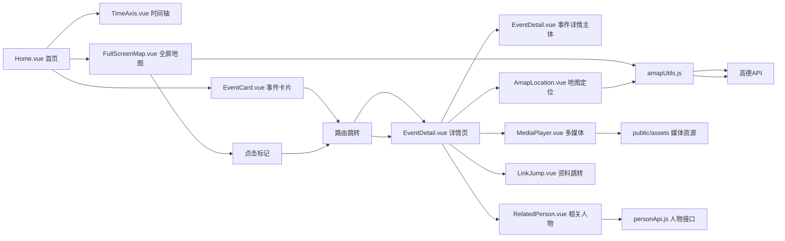

你希望基于“首页时间轴+事件+图片、详情页多媒体+高德地图、地图-时间轴联动”的核心功能，重新梳理前端和后端的项目结构，并明确各模块的**引用关系**（组件间、接口间、前后端间），以便让团队成员清晰知道代码的依赖和调用逻辑。以下是适配该功能的项目结构+详细引用关系说明，兼顾规范性和新手可读性：

---a

## 一、前端项目结构（Vue3 + Vite）
### 核心设计逻辑
按“页面-组件-工具-API”分层，所有功能模块（时间轴、地图、详情页）拆分为独立组件，通过**组件引用**和**API调用**实现联动，贴合“首页+详情页+地图联动”的核心需求。

```
red-history-timeline-frontend/
├── public/                  # 静态资源（不编译，直接访问）
│   ├── assets/              # 媒体资源（事件图片/视频/音乐）
│   │   ├── images/          # 事件配图（如长征_瑞金.jpg）
│   │   ├── videos/          # 历史视频（如长征_遵义会议.mp4）
│   │   └── audios/          # 红色音乐（如十送红军.mp3）
│   └── config/              # 高德地图密钥配置（单独存放，避免硬编码）
│       └── amapKey.js       # 高德API Key（全局引用）
├── src/
│   ├── api/                 # 后端接口封装（统一调用入口）
│   │   ├── eventApi.js      # 事件相关接口（查询列表/详情/筛选）
│   │   ├── personApi.js     # 相关人物接口（查询人物详情）
│   │   ├── locationApi.js   # 地点/坐标接口（查询高德坐标）
│   │   └── mediaApi.js      # 媒体资源接口（图片/视频/音乐链接）
│   ├── components/          # 业务组件（按功能拆分，可复用）
│   │   ├── home/            # 首页专属组件
│   │   │   ├── TimeAxis.vue # 核心：时间轴组件（渲染事件+图片）
│   │   │   ├── EventCard.vue # 事件卡片（图片+事件标题，点击跳转详情）
│   │   │   └── FullScreenMap.vue # 首页全屏地图（高德API，事件地点标记）
│   │   ├── detail/          # 详情页专属组件
│   │   │   ├── EventDetail.vue # 事件详情主体（描述+媒体+地图）
│   │   │   ├── MediaPlayer.vue # 多媒体播放器（图片轮播+视频/音乐播放）
│   │   │   ├── AmapLocation.vue # 高德地图定位（事件发生地标注）
│   │   │   └── RelatedPerson.vue # 相关人物（点击展示人物详情）
│   │   └── common/          # 通用组件（全局复用）
│   │       ├── LinkJump.vue # 相关资料跳转（按钮+新窗口打开）
│   │       └── BackButton.vue # 返回按钮（详情页→首页）
│   ├── views/               # 页面级组件（整合组件，对应路由）
│   │   ├── Home.vue         # 首页（引用TimeAxis+EventCard+FullScreenMap）
│   │   └── EventDetail.vue  # 事件详情页（引用所有detail组件+common组件）
│   ├── router/              # 路由配置（页面跳转）
│   │   └── index.js         # 路由规则（/ → Home，/detail/:id → EventDetail）
│   ├── utils/               # 工具函数（全局复用）
│   │   ├── request.js       # 请求封装（axios，统一处理接口响应）
│   │   ├── amapUtils.js     # 高德地图工具（初始化/定位/标记封装）
│   │   └── formatUtils.js   # 数据格式化（时间/坐标格式转换）
│   ├── styles/              # 全局样式
│   │   ├── base.scss        # 基础样式（红色主题+重置样式）
│   │   └── media.scss       # 多媒体样式（播放器/图片轮播）
│   ├── App.vue              # 根组件（挂载路由）
│   └── main.js              # 入口文件（引入Vue/路由/高德API/全局样式）
├── package.json             # 依赖（vue、axios、echarts、amap-jsapi-loader）
└── vite.config.js           # 配置（代理后端接口、环境变量）
```

### 前端核心引用关系（关键！）
#### 1. 组件间引用关系


#### 2. API/工具引用关系
- 所有组件中的数据请求 → 引用`src/api/`下的接口文件 → 接口文件引用`utils/request.js` → 调用后端接口；
- 所有地图相关组件（FullScreenMap、AmapLocation）→ 引用`utils/amapUtils.js` → 引用`public/config/amapKey.js` → 调用高德API；
- 时间轴/事件卡片 → 引用`api/eventApi.js` → 获取事件列表/图片/基本信息；
- 详情页多媒体 → 引用`api/mediaApi.js` → 获取视频/音乐链接；引用`public/assets` → 加载本地媒体资源。

---

## 二、后端项目结构（Java + Spring Boot）
### 核心设计逻辑
按“控制器-服务-数据模型-数据库”分层，围绕“事件、人物、地点、媒体”四大核心实体提供接口，适配前端的多维度数据请求，同时关联高德坐标和媒体资源。

```
red-history-timeline-backend/
├── src/main/java/com/redhistory/ # 核心代码包
│   ├── controller/            # 接口控制器（接收前端请求，返回响应）
│   │   ├── EventController.java # 事件接口（列表/详情/按地点/时间筛选）
│   │   ├── PersonController.java # 人物接口（详情/按事件关联查询）
│   │   ├── LocationController.java # 地点接口（坐标/按事件关联查询）
│   │   └── MediaController.java # 媒体接口（图片/视频/音乐链接查询）
│   ├── service/               # 业务逻辑层（处理核心逻辑）
│   │   ├── EventService.java  # 事件业务（关联人物/地点/媒体）
│   │   ├── PersonService.java # 人物业务
│   │   ├── LocationService.java # 地点业务（关联高德坐标）
│   │   └── MediaService.java  # 媒体业务（资源链接管理）
│   ├── mapper/                # 数据访问层（MyBatis，操作数据库）
│   │   ├── EventMapper.java   # 事件数据库操作
│   │   ├── PersonMapper.java  # 人物数据库操作
│   │   ├── LocationMapper.java # 地点数据库操作
│   │   └── MediaMapper.java   # 媒体数据库操作
│   ├── model/                 # 数据模型（实体类，对应数据库表）
│   │   ├── Event.java         # 事件实体（id/名称/时间/描述/地点id）
│   │   ├── Person.java        # 人物实体（id/姓名/简介/关联事件id）
│   │   ├── Location.java      # 地点实体（id/名称/高德坐标/关联事件id）
│   │   └── Media.java         # 媒体实体（id/类型/链接/关联事件id）
│   ├── config/                # 配置类
│   │   ├── MyBatisConfig.java # MyBatis配置（数据库连接）
│   │   ├── CorsConfig.java    # 跨域配置（允许前端访问）
│   │   └── AmapConfig.java    # 高德API配置（可选：后端调用高德坐标解析）
│   ├── util/                  # 工具类
│   │   ├── ResponseUtil.java  # 统一响应格式（code/msg/data）
│   │   └── AmapUtil.java      # 高德工具（后端解析地址→坐标）
│   └── RedHistoryApplication.java # 启动类
├── src/main/resources/
│   ├── application.yml        # 配置文件（数据库/端口/高德Key）
│   ├── mybatis/               # MyBatis映射文件（SQL语句）
│   │   ├── EventMapper.xml
│   │   └── ...
│   └── static/                # 后端静态资源（可选：媒体资源备份）
├── src/test/java/             # 测试类（接口测试）
├── pom.xml                    # Maven依赖（Spring Boot/MyBatis/MySQL）
└── scripts/                   # 辅助脚本
    ├── init-db.sql            # 数据库初始化脚本（建表语句）
    └── import-data.sql        # 历史数据导入脚本（事件/人物/坐标）
```

### 后端核心引用关系（关键！）
#### 1. 代码层引用关系
```mermaid
graph LR
    Controller[Controller 控制器] --> Service[Service 业务层]
    Service --> Mapper[Mapper 数据访问层]
    Mapper --> Database[MySQL 数据库]
    
    EventController --> EventService --> EventMapper
    EventService --> PersonService # 关联人物查询
    EventService --> LocationService # 关联地点/坐标查询
    EventService --> MediaService # 关联媒体资源查询
    
    LocationService --> AmapUtil # 高德坐标解析（可选）
    所有Controller --> ResponseUtil # 统一响应格式
```

#### 2. 前后端接口调用关系
| 前端API文件       | 调用后端Controller       | 核心接口功能                                  |
|-------------------|--------------------------|-----------------------------------------------|
| eventApi.js       | EventController          | 查询事件列表、事件详情、按时间/地点筛选事件    |
| personApi.js      | PersonController         | 查询人物详情、按事件ID查询关联人物            |
| locationApi.js    | LocationController       | 查询地点名称+高德坐标、按事件ID查询关联地点    |
| mediaApi.js       | MediaController          | 查询事件关联的图片/视频/音乐链接              |

---

## 三、核心功能-代码引用链路示例（新手易理解）
以“点击首页地图标记→跳转到详情页→显示事件+地图定位”为例，完整链路：
1. **前端首页**：`Home.vue` 引用 `FullScreenMap.vue` → 调用 `locationApi.js` 获取所有事件坐标 → 调用 `amapUtils.js` 渲染地图标记；
2. **交互触发**：点击地图标记 → 触发路由跳转（携带事件ID）→ 进入 `EventDetail.vue` 详情页；
3. **详情页加载**：`EventDetail.vue` 调用 `eventApi.js`（传事件ID）→ 后端 `EventController` 接收请求 → `EventService` 关联查询事件+人物+地点+媒体 → 返回数据；
4. **详情页渲染**：
   - 事件描述/媒体 → 渲染 `MediaPlayer.vue`；
   - 高德坐标 → 调用 `amapUtils.js` → 渲染 `AmapLocation.vue` 定位事件发生地；
   - 相关人物 → 渲染 `RelatedPerson.vue`，点击人物 → 调用 `personApi.js` 显示人物详情；
   - 资料跳转 → 渲染 `LinkJump.vue`，点击跳转外部链接。

---

### 总结
1. **前端结构**：按“页面-业务组件-通用组件”拆分，核心围绕“首页（时间轴+地图）”和“详情页（多媒体+地图+人物）”，所有地图功能复用`amapUtils.js`，数据请求复用`request.js`，保证代码统一；
2. **后端结构**：按Spring Boot分层（控制器-服务-数据层），围绕“事件”核心实体，关联人物/地点/媒体数据，提供前端所需的所有接口；
3. **引用关系**：前端组件间通过路由/直接引用联动，前后端通过标准化接口调用，地图功能统一依赖高德API工具类，确保“点击地图→时间轴联动→详情页展示”的核心逻辑闭环。

这套结构完全匹配你的功能需求，且每个文件的职责和引用关系清晰，大学生团队可按此结构分工开发，避免代码混乱。